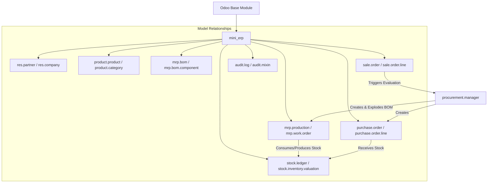
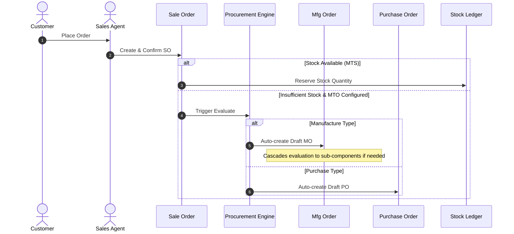

# Mini ERP — Complete Manufacturing & Procurement ERP (Odoo 18)

Mini ERP is a streamlined, high-performance Odoo 18 custom module designed to manage the end-to-end flow from demand to delivery, built specifically for manufacturing business environments.

---

## 1. Architecture Overview

Mini ERP maps cleanly to physical stock transactions and production steps using standard Odoo models and customized hooks:
- **Sales & Demand**: Client orders capture demand and trigger automated procurement rules if sufficient inventory is not available.
- **Procurement Strategy Engine (MTS/MTO)**: Auto-replenishes inventory by executing make-to-order (MTO) cascades or checking against minimum stock rules (MTS).
- **Manufacturing & Bill of Materials (BoM)**: Explodes material recipes, manages raw components reservation, tracks work order progress, and computes final yield.
- **Stock Ledger & Inventory Valuation**: Transactional log updates on hand quantities, computes inventory valuation (quantity × cost price), and supports optional negative stock block/warn modes.
- **Audit & Compliance Trail**: Tracks creation, updates, and deletion of records across key models.

---

## 2. Module Dependency Graph



---

## 3. Workflow & Cascading Procurement

### Sales-to-Delivery Process Flow



---

## 4. User Roles & Permissions

Mini ERP defines strict user authorization profiles:
- **Sales User**: Full access to Customers (`res.partner`), Products, and Sales Orders (`sale.order`).
- **Purchase User**: Full access to Vendors, Products, and Purchase Orders (`purchase.order`).
- **Manufacturing User**: Full access to Bills of Materials (`mrp.bom`) and Manufacturing Orders (`mrp.production`).
- **Inventory User**: Access to Products, Stock Ledgers (`stock.ledger`), Delivery Wizards, and Receipt Wizards.
- **Administrator**: Unrestricted root access, including full audit trail visibility (`audit.log`).

---

## 5. Setup & Running Instructions

Please refer to the detailed guide in [GETTING_STARTED.md](file:///c:/Users/LAPTOP-PR1211/Documents/OdooxParul/MiniERP/GETTING_STARTED.md) for environment configuration, database boot steps, and dependency installs.

### Quick Start:

1. **Activate Virtual Environment:**
   ```powershell
   .\venv\Scripts\Activate.ps1
   ```
2. **Launch Postgres Container:**
   ```bash
   docker compose up -d
   ```
3. **Run Odoo Server:**
   ```bash
   python odoo/odoo-bin -c odoo.conf -d mini_erp
   ```
4. **Run Integration Tests:**
   ```bash
   python odoo/odoo-bin -c odoo.conf -d mini_erp -u mini_erp --test-enable --stop-after-init
   ```

---

## 6. PDF Reports & Dashboard Analytics

- **QWeb PDF Reports:** Direct print actions exist on Sales Orders, Purchase Orders, Manufacturing Orders (with BoM explosion), Stock Ledger movements, and Inventory Valuation summaries.
- **Dashboard Widget:** Access the **Dashboard** from the Odoo top menu. It displays glassmorphism KPI cards (SO counts, MO progress, PO receipt status, Low Stock warnings) with interactive filtering click-through behavior, alongside the real-time Audit Trail log.
